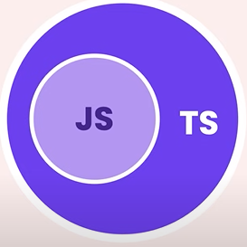

# Lesson 1: Introduction Typesript

## What is Typescript?
- Typescript is a programming language to address shortcomings of Javascript.
- Typescript is Javascript with Type Checking.
- Typescript has all attribute of Javascript and more feature. It's super Javascript.



## Statically - typed and Dynamically - typed


## Typescript compiler and Debugger

### How this work?
When your create a variable typescript,
 ex:  let  a: number  = 10;
Typescript will pass this value and catch the error when value is not a number type.

### Created new tsConfig.json file:

```js
tsc --init
```
We have tsConfig.json. The contents of this file are the project's general configuration, example:

### How to debug typescript project?

# Lesson 2: Fundamentals


## The any type
This data type allows declaring a variable without specifying the data type of that variable. It's like declaring let a = 2

```js
let a  = 2 // this is any type
let a : any = 2 // The a variable in typescript that can write there. 
//So typescript can't be applied effectively because it's no different than javascript
```
## Arrays
- Ex: Create A array number:

```js
let nums: number[]  = [1 , 2 ,3 ]
```
- Example: Create A array string:
```js
let nums: string[]  = ["a","b","c"]
```
## Tuples
A tuple is a typed array with a pre-defined length and types for each index.
- Example:
```js
// define our tuple
let ourTuple: [number, boolean, string];

// initialize correctly
ourTuple = [5, false, 'Coding God was here'];
```
For example, the ourTuple[0] is number so  ourTuple[0] can use function of Number Type. 

## Enums
- Example:
```js
const enum Size{ Small  =1 , Medium = 2, Large = 2}
//use this enum
let mySize : Size  = Size.Small
```
## Functions
- Example create function return number type:

```js
    function Sum(a: number, b: number) :numer{
        return a + b;
    }
```
## Objects

### '?' and required attribute:
I want to create Employee with attribute : name, isInRelationship, gender. Typescript code is bellow:

```js
let emoployee  :{
    name: string,
    isInRelationship : boolean,
    gender: string,
} = {name :"Mr A",isInRelationship: true, gender:"male"}
```
So, as a result the attribute isInRelationship is not required. How to turn off required one attribute in typescript code, this is solution:
```js
let emoployee  :{
    name: string,
    isInRelationship?: boolean, // this attribute is not required.
    gender: string,
} = {name :"Mr A", gender:"male"}
```
### Read only attribute:
- Syntax:

```readonly <name_variable> : <type>```
- Example:

```js
let employee  :{
    readonly name: string,
    isInRelationship?: boolean, // this attribute is not required.
    gender: string,
} = {name :"Mr A", gender:"male"}
//so
employee.name  = "Mr B "
 // catch error because this value is read only.

```

# Lession 3: Advanced types

In the past 2 lessons, you have become familiar with the basic data types of Typescript. With this lesson, we will learn more deeply and more advanced about other data types in Typescript.

## 3.1 Type aliases
 ```js
type Employee = {
   readonly name: string,
    isInRelationship?: boolean,
    gender: string,
}
let employee : Employee = {name :"Mr A", gender:"male"}
 ```

## 3.2 Unions and intersections

### Unions type:
- You can use more type for variable 
- Example: 
```js
    function myKg(weight : number | string) {} //union type
    mykg(60) // true
    mykg("60kg") // true
    mykg(true) // false because weight value must be number or string.
```
### Intersections type:

- Example:
```js
    type Draw = {
        drawing : () => void;
    }
    type ClearPhoto = {
        clear :() => void
    }
    //so intersections allow mix 2 type, bellow:
    type Painting = Draw & ClearPhoto
    let actor: Painting = {
        drawing  : () => void
        clear :() => void
    }
```
##  3.3 Narrowing type
- Example:
```js
  function myKg(weight : number | string): number {
    //Narrowing
    if(typeof weight === number)
    return weight;
    else
    return parseInt(weight)
  }
  myKg(20) // return 20
```
## 3.4 Literal types
- Example:
```js
type Quantity  = 50 | 100
let quantity : Quantity = 51 

```
## 3.5 Nullable types
- Example:
```js
    function greet(name  :string | undefinded | null){
        if(name)
            console.log(name.toUpperCase())
        else
            console.log('hello world')
    }

    greet(null) // helo world
    greet("Mr A") // MR A
```
## 3.6 Optional Chaining
- Example:
```js
type Customer = {
    birthday?: Date
}
function getCustomer(id: number) : Customer | null |undefinded {
    return id === 0 ?  null : birthday;
}
//case 1:
let customer = getCustomer(1)
console.log(customer) // quang

//case 2:
let customer2 = getCustomer(0)
// Optional property access operator
console.log(customer2?.birthday)  // undefinded

console.log(customer2?.birthday.getFullYear())  //=> catch error

console.log(customer2?.birthday?.getFullYear())  // undefinded

//Optional call
let log: any  = null

log?.('A') // null

```
